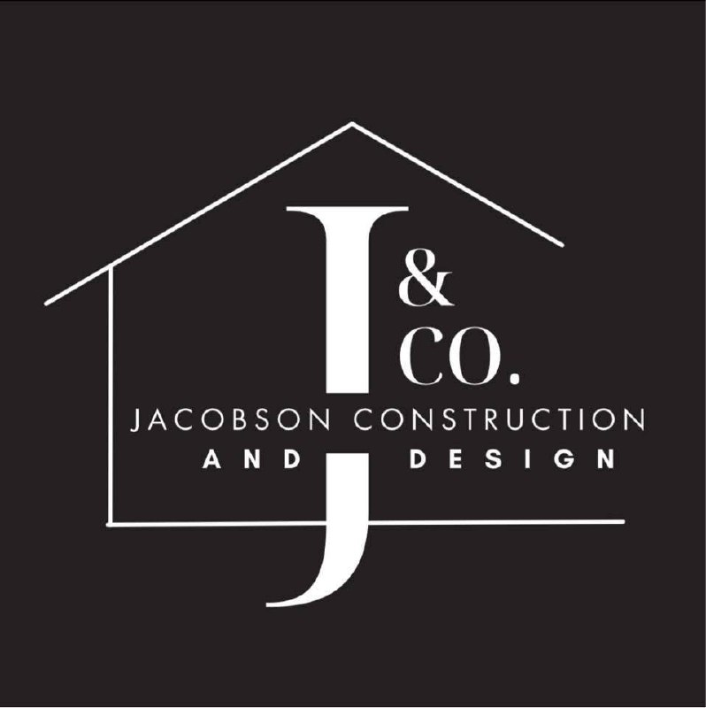

# Jacobson Construction & Design — MOCKUP Design Spec v1.0

**MANDATE (from Dave): "This website needs to be the best fucking construction website out there!"**

This file is the SINGLE SOURCE OF TRUTH. Read it fully before writing any code. Build against `css/styles.css` — use ONLY the classes it defines. If something is missing, note it in your NOTES.md; do NOT invent ad-hoc styles.

---

## 1. Brand facts (VERIFIED — use only these)

- Legal name: **Jacobson Construction & Design LLC**
- Tagline: **"Residential & Commercial Construction — Building Your Dreams, One Project at a Time"**
- Phone: **(507) 211-1111** → link `tel:+15072111111"Licensed & Insured".

## 2. Design tokens (defined in css/styles.css — use ONLY these)

- **Colors:** charcoal-950 `#0B0F14`, charcoal-900 `#10151C`, charcoal-800 `#1B2430`, stone-100 `#F4F5F7`, stone-200 `#E4E7EB`, gray-500 `#6B7280`, amber-500 `#F59E0B`, amber-600 `#D97706`, white `#FFFFFF`
- **Fonts** (loaded in styles.css): **"Barlow Condensed"** 600/700 uppercase for display headings · **"Inter"** 400/500/600/700 for body
- Radius 8px · container max 1200px · section padding 80px desktop / 56px mobile
- Buttons: `.btn .btn-primary` (amber, primary CTA) · `.btn .btn-outline` (on dark) · `.btn .btn-light` (on dark, white bg)

## 3. Logo files (use both, never stretch — keep aspect ratio)

| File | Variant | Use on |
|---|---|---|
| `images/img_635456e81034.jpg` | Monogram — white on black ("J&Co" + name) | Dark backgrounds: header, footer, hero |
| `images/img_4bfbf4f96ac0.jpg` | Lockup — house icon + "JACOBSON" black on white | Light backgrounds: light sections, About page |

## 4. Shared HEADER (paste verbatim into every page; the active page gets `class="active"`)

```html
<header class="site-header">
  <div class="container header-inner">
    <a href="index.html" class="brand" aria-label="Jacobson Construction and Design — home">
      
    </a>
    <nav class="site-nav" id="site-nav" aria-label="Main navigation">
      <a href="index.html">Home</a>
      <a href="services.html">Services</a>
      <a href="portfolio.html">Portfolio</a>
      <a href="gallery.html">Gallery</a>
      <a href="about.html">About</a>
      <a href="estimate.html" class="btn btn-primary nav-cta">Get a Free Estimate</a>
      <a href="tel:+15072111111" class="nav-phone">(507) 211-1111</a>
    </nav>
    <button class="nav-toggle" id="nav-toggle" aria-expanded="false" aria-controls="site-nav" aria-label="Toggle menu">
      <span></span><span></span><span></span>
    </button>
  </div>
</header>
```

## 5. Shared FOOTER (paste verbatim into every page)

```html
<footer class="site-footer">
  <div class="container footer-grid">
    <div class="footer-brand">
      
      <p class="footer-tagline">Residential &amp; Commercial Construction — Building Your Dreams, One Project at a Time.</p>
      <p class="footer-badge">Licensed &amp; Insured</p>
    </div>
    <div class="footer-col">
      <h3>Pages</h3>
      <a href="index.html">Home</a>
      <a href="services.html">Services</a>
      <a href="portfolio.html">Portfolio</a>
      <a href="gallery.html">Gallery</a>
      <a href="about.html">About</a>
      <a href="estimate.html">Free Estimate</a>
    </div>
    <div class="footer-col">
      <h3>Services</h3>
      <span>Residential New Build &amp; Remodel</span>
      <span>Commercial &amp; Municipal</span>
      <span>Metal Buildings</span>
      <span>Interior Finish &amp; Design</span>
    </div>
    <div class="footer-col">
      <h3>Contact</h3>
      <a href="tel:+15072111111">(507) 211-1111</a>
      <a href="mailto:info@jacobsonconstructionanddesign.com">info@jacobsonconstructionanddesign.com</a>
      <span>Serving Austin, Albert Lea &amp; Southern Minnesota</span>
    </div>
  </div>
  <div class="footer-bottom">
    <div class="container footer-bottom-inner">
      <span>© 2026 Jacobson Construction &amp; Design LLC. All rights reserved.</span>
      <span>Website by <a href="https://ironprairie.netlify.app" target="_blank" rel="noopener">Iron Prairie Web Development</a></span>
    </div>
  </div>
</footer>
```

Every page loads `<script src="scripts.js" defer></script>` before `</body>`.

## 6. Page recipes

### index.html — HOME (flagship)
1. **Hero** — full-width, min 80vh, dark overlay. Background: best available photo (see Asset Map). Content: monogram logo, h1 "Building Your Dreams, One Project at a Time", sub-line "Residential & Commercial Construction — Licensed & Insured", dual CTA [btn-primary "Get a Free Estimate" → estimate.html] [btn-outline "Call (507) 211-1111" → tel:+15072111111"Licensed & Insured" | "Family-Owned" | "One Project at a Time" | "Serving Southern MN".
3. **Services** — 4 cards: Residential New Build & Remodel / Commercial & Municipal / Metal Buildings / Interior Finish & Design. Each: title, 2-3 bullets, "Learn more →" to services.html.
4. **Featured Projects** — 3-6 real photos grid (use confirmed project photos), each captioned; "View full portfolio →" to portfolio.html.
5. **Why Choose Jacobson** — two-column: family photo (img_85c73acc7417.jpg cropped tight) + copy: family-owned, one project at a time, real craftsmanship, licensed & insured. Plus the lockup logo (img_4bfbf4f96ac0.jpg).
6. **Testimonials** — 2-3 GENERIC placeholder quotes (see Copy rules — no real names).
7. **Service Area** — "Austin, Albert Lea, and Southern Minnesota — Mower & Freeborn Counties and beyond." (verified: Albert Lea area per lead)
8. **Final CTA band** — dark, "Building your dreams, one project at a time." + [Get a Free Estimate] button.

### services.html
1. Page hero (short): heading "Our Services", breadcrumb-free, sub "Residential & Commercial Construction".
2. **Residential** section: New Build · Remodel · Interior Finish. What's-included bullets.
3. **Commercial & Municipal** section: Fit-outs, Metal Buildings, Municipal (water plant, gyms, offices).
4. **Metal Buildings** section: highlighted as a specialty lane.
5. **How We Build** — 3-step process cards: Foundation → Framing → Finish, using process photos (wood frame img_9475c3afffd4.jpg; kitchen-in-progress img_ab1a834a10c9.jpg).
6. **FAQ** — <details> accordion, 6 Qs: cost (every job quoted — free estimates), timeline (depends on scope — free estimate includes timeline), permits (handled/licensed), insurance (licensed & insured), service area (Austin, Albert Lea, Southern MN), payments/financing (ask at estimate). NO invented prices.
7. CTA band: [Get a Free Estimate] [Call].

### portfolio.html
1. Short hero: "Our Work".
2. **Filter tabs** (JS-free is fine — or simple JS toggle): Residential / Commercial / Municipal / All. Simplest robust: three sections with headings (Residential Projects / Commercial & Municipal / Construction Process), no broken JS.
3. **Flagship case-study cards** (3): gym fit-out, Hartland Water Plant, metal building — label these ONLY if the photo is confirmed by vision; otherwise "Featured Commercial Project". Include: what was done (generic: "Complete interior build-out"), scope bullets.
4. Caption every photo: short, honest ("Commercial gym fit-out — southern MN", "Finished kitchen remodel", "Steel-frame construction — project in progress"). Use vision to confirm what each photo shows before captioning specifics; otherwise generic caption by section.
5. CTA band.

### gallery.html
1. Short hero: "Project Gallery".
2. **Full grid** — ALL photos from images/ (minus the two logos). Grouped by section: Residential / Commercial / Process. Click opens lightbox (scripts.js provides `.lightbox` behavior — attach class + data-caption).
3. Generic captions by section for unconfirmed photos; specific captions only when vision-confirmed.

### about.html
1. Short hero: "About Jacobson Construction & Design".
2. **Story** — family-owned; the owners are hands-on; one project at a time; licensed & insured. Include family photo (img_85c73acc7417.jpg) and lockup logo.
3. **Meet the Crew** — group photo (img_cf2d2908c378.jpg) LARGE + solo photo (img_ade9e7a9c7e8.jpg); caption "Our crew — every project gets personal attention." NO invented names.
4. **Values / Why Jacobson** — 3-4 cards: Craftsmanship, Family Values, One Project at a Time, Licensed & Insured.
5. CTA band.

### estimate.html
1. Short hero: "Get a Free Estimate".
2. **Form** (primary): project type select (Residential New Build / Remodel / Commercial / Metal Building / Other), project size, timeline, budget range (optional), name, phone, email, message. Submit = btn-primary. On submit, scripts.js shows a success message (demo — no backend).
3. **Direct contact** column: phone (tap-to-call), email, service area, "Free estimates · Licensed & Insured".
4. **Response promise**: "We'll get back to you within one business day."
5. FAQ teaser (2-3 Qs) or link to services FAQ.

## 7. Asset map (photos in images/ — 39 files, 2 are logos)

**Confirmed (use for these purposes):**
| File | Content | Use |
|---|---|---|
| img_635456e81034.jpg | Logo monogram (white on black) | header/footer/hero |
| img_4bfbf4f96ac0.jpg | Logo lockup (house icon, black on white) | light sections |
| img_cf2d2908c378.jpg | Crew group — 5 people | About "Meet the Crew" |
| img_ade9e7a9c7e8.jpg | Crew member solo at job site | About crew card |
| img_9475c3afffd4.jpg | Wooden frame structure, rural | How We Build / process |
| img_612ba8db6c93.jpg | House exterior, red wall, ladder, blue sky | Residential portfolio / hero candidate |
| img_80c3458b3034.jpg | Rustic interior — shop/kitchen, metal shed | Metal building / commercial interior |
| img_ab1a834a10c9.jpg | Kitchen mid-renovation (tape, plastic, mixer) | Process / before-during |
| img_50294382796b.jpg | Finished marble-tile bathroom | Residential portfolio |
| img_d4588d56b90d.jpg | Finished modern kitchen with island | Residential portfolio / hero candidate |
| img_85c73acc7417.jpg | Family photo (IG screenshot, watermark) | About story (crop tight) |

**Unconfirmed (Aug 23 batch — residential/commercial/process per research):** img_0f15567a8350, img_21ea02f989ad, img_27079f768ef6, img_2d95828c6c1f, img_41cdfde55baf, img_579304a14f75, img_57c45077cf8a, img_5986c03c0d7b, img_6d26cf850ba8, img_78170c16d8d9, img_7df988f474e1, img_8705b965aa51, img_8a64e7b52d30, img_996ebf3003dd, img_a7134db32c32, img_a876cf122b35, img_abdcd8e87cb3, img_ada5dbf8b0fe, img_af307170eaf6, img_b51d5775e399, img_bb369ce11d7f, img_bd5f76920c95, img_c26c4b9e3423, img_cc138aa6d9d6, img_dadbe57c4bb4, img_f48b85616a0e, img_f6c72e2fc211

**Rule for unconfirmed:** you MAY call vision_analyze on up to 6 images to find hero/gym/water-plant candidates. For captions, use generic section captions unless you confirmed the content. NEVER caption something you haven't confirmed.

## 8. Copy rules
- Primary CTA text: **"Get a Free Estimate"** everywhere. Secondary: "Call (507) 211-1111".
- Testimonials = GENERIC placeholders only, e.g. "Beautiful work — we couldn't be happier with our new space." — *Homeowner, Austin MN*. Max 3. No real names.
- No lorem ipsum. No stock-photo language. No "YOUR LOGO HERE".
- `alt` text on every image (descriptive, e.g. "Commercial gym fit-out by Jacobson Construction").

## 9. Global acceptance criteria (every page)
- Valid HTML5, single h1 per page, real href/src paths (all images exist in images/), all internal links point to real pages.
- Header + footer identical across pages (only active nav class changes).
- Uses ONLY classes from css/styles.css; loads scripts.js before </body>.
- Fully responsive: 375px mobile, 768px tablet, 1280px desktop — no horizontal scroll, tap targets ≥44px.
- Phone number is a tap-to-call link on every page.
- No fabricated claims (no invented years/counts/names/reviews/prices).
- Mobile menu works (nav-toggle toggles site-nav).

## 10. Out of scope
- NO working backend/forms (demo submit only), NO CMS, NO SEO/deployment, NO custom domain, NO stock photos, NO invented client data, NO changes to css/styles.css (note missing styles in NOTES.md instead), NO edits to other workers' files.

## 11. Verify
- Worker: after writing, run a local check — `python3 -m http.server` optional; at minimum verify all image paths exist (`ls images/`), all hrefs resolve to the 6 pages, and open the file to confirm structure. Note any gaps in NOTES.md.
- Orchestrator (Electra): integrates files, runs a link/image checker, browser-renders at 3 widths, then Ironhead QC + final QC before deploy.
